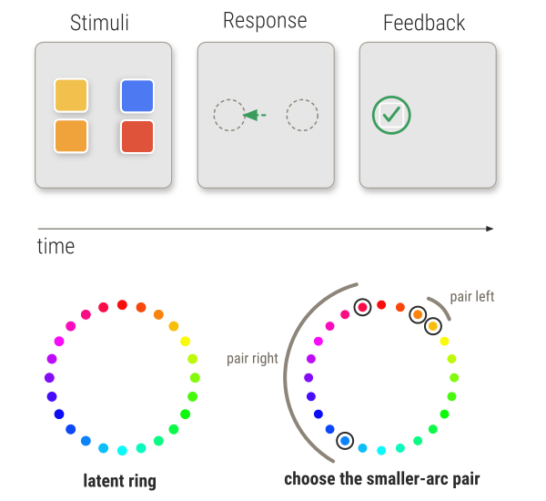
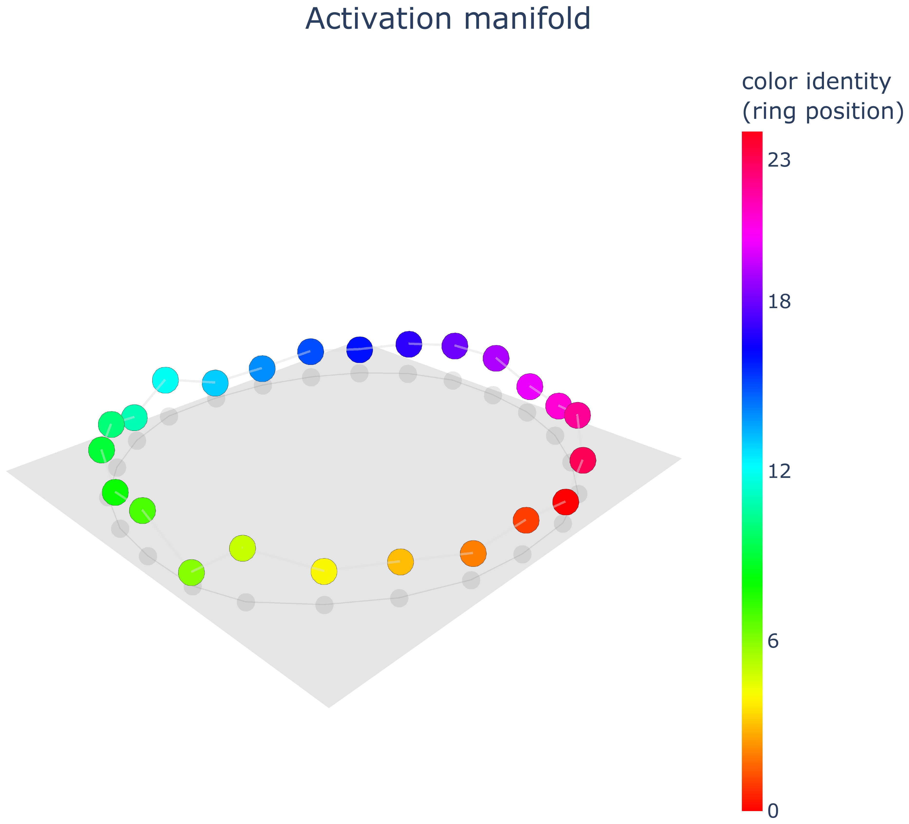
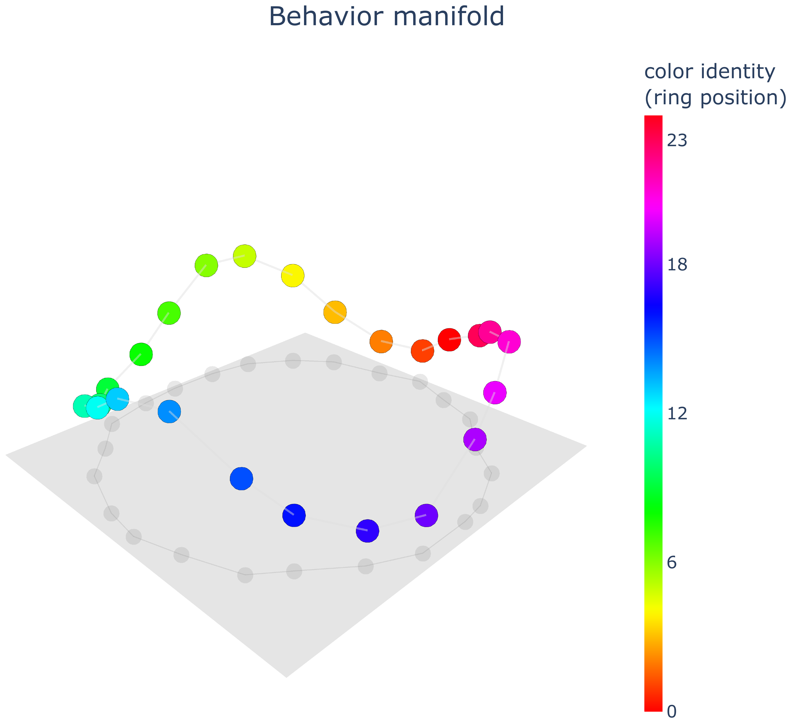
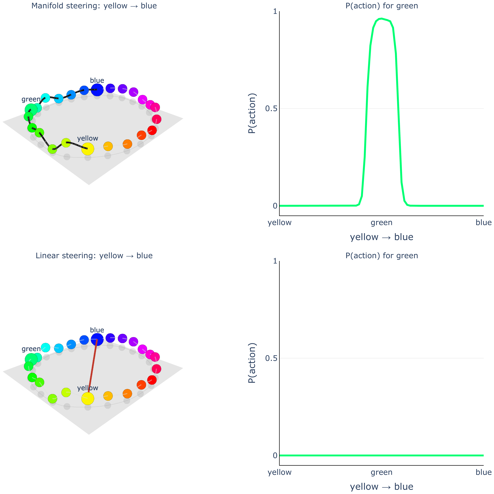
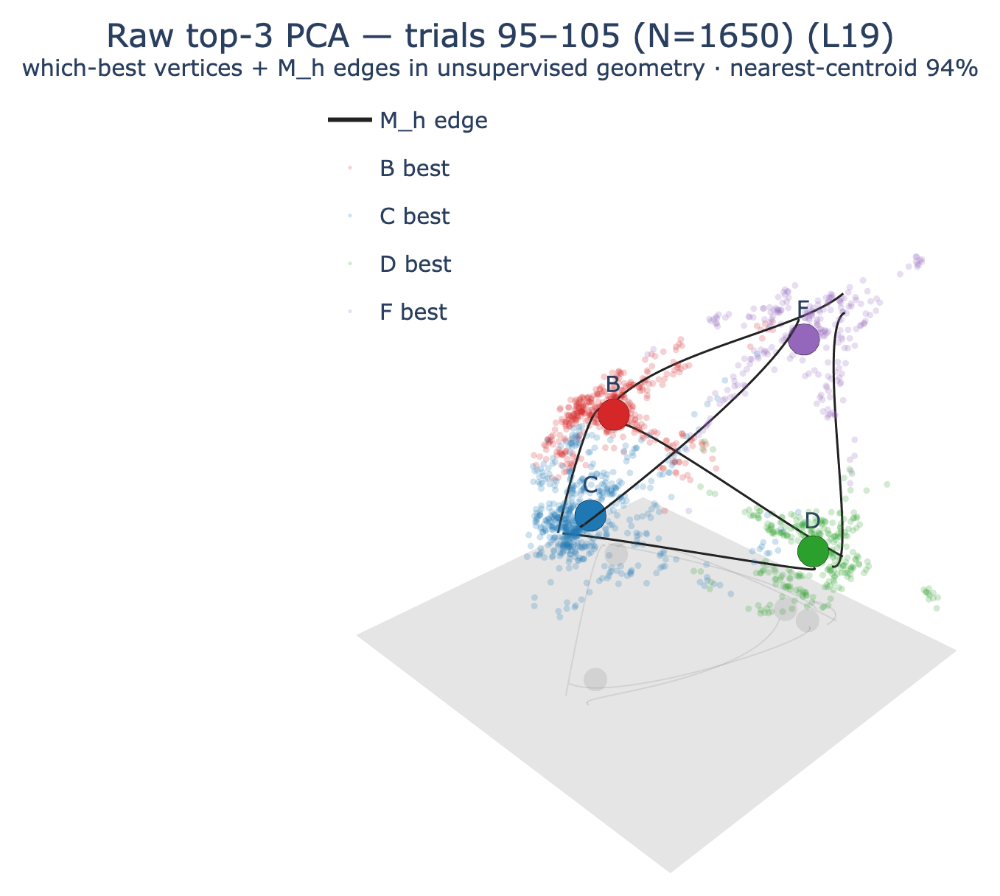
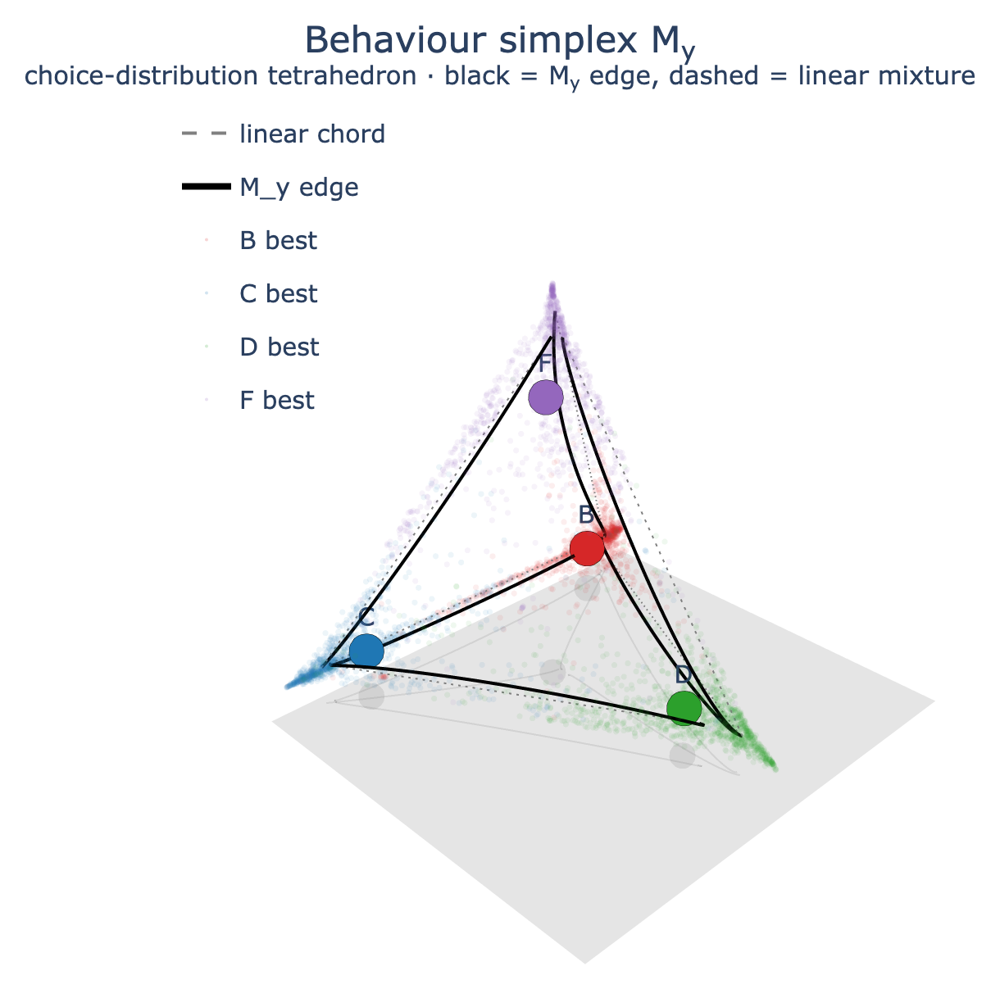

# Manifold Steering

This repo reproduces and extends *Manifold Steering Reveals the Shared Geometry of Neural Network Representation and Behavior* (Goodfire, 2026). The central claim, in one breath: a model's internal representations and its behavior trace out the *same* curved manifold, and the cleanest way to causally move behavior is to move activations **along** that manifold rather than straight across it.

**▶ Start with the interactive walkthroughs: [simonedambrogio.github.io/manifold-steering](https://simonedambrogio.github.io/manifold-steering/)** — two scroll-driven explainers that step through every result below with live 3-D figures. (Source in [`presentation/`](presentation/); run locally with `python presentation/serve.py`.)

---

## A clean demonstration: the color pair ring

A set of 24 colors lives on a **hidden ring**. Each trial shows two pairs of colors; the model must pick the pair whose colors are closer *around the ring*. The ring is never given (colors arrive as orthogonal codes, equidistant by construction). The only place the ring exists is in which answer is rewarded. To generalize to pairs it never saw in training, the network has no choice but to **fold the colors into a ring**.

<p align="center"></p>

### 1 · The ring appears in the representation

Project the learned color embeddings onto their top three principal components and connect them in ring order. They close into a loop. The network folded the latent ring into its activations, with no prompting. This is the **activation manifold** $\mathcal{M}_h$.

### 2 · The same ring is in the behavior

Now throw the internals away. Using **only the model's binary choices**, reconstruct distances between colors and embed them. The same rainbow loop returns. The behavior, not just the representation, honors the ring. This is the **behavior manifold** $\mathcal{M}_y$.

| Representation | Behavior |
|:---:|:---:|
|  |  |

The two are not just similar in shape. They are **isometric**: distances measured *along* the activation manifold predict distances *along* the behavior manifold almost perfectly ($r = 1.00$), while straight chord distances do not ($r = 0.98$, and systematically bent).

### 3 · Steering along the ring works, cutting across it does not

The causal test. Move one color's activation from **yellow → blue** and read off the model's choices. Travel **along** the manifold and the activation passes through green: `P(action)` for green rises to a peak, then fades, exactly as a real green would behave. Travel in a **straight line** through representation space and you cut across the ring's interior, off the manifold, into nowhere the network has ever been: green **never** activates.

<p align="center"></p>

**Same start, same end, different path, and only the manifold path moves behavior coherently.** That is manifold steering.

---

## The main project: steering an LLM's latent *value*

The color pair net is the clean testbed. The research question is whether the same geometry governs a **latent intermediate variable** inside a real LLM: not an output concept, but a *belief*.

We have **Llama 3.1 8B Instruct play a restless bandit with four arms**: rewards drift, so the model must keep tracking which arm is currently best. We fit a cognitive model to its choices to recover the **value** `Q` it assigns to each arm, and ask whether that value lives on a manifold we can steer along.

It does, and the geometry rhymes with the color pair ring. The "which arm is best" structure forms a **simplex** (tetrahedron) that appears in both the residual stream ($\mathcal{M}_h$) and the choice behavior ($\mathcal{M}_y$):

| Activation simplex $\mathcal{M}_h$ | Behaviour simplex $\mathcal{M}_y$ |
|:---:|:---:|
|  |  |

Steering along it works: an intervention that carries value moves Llama's choice predictably (`P(target) 0.33 → 0.70`), specifically to that arm, and through the **value** pathway rather than recency. Full report: [`dev/context/value-steering/summary.md`](dev/context/value-steering/summary.md).

---

## Repository layout

| Path | What |
|---|---|
| `presentation/` | **Interactive scroll-driven explainers for the key results** (`python presentation/serve.py`) |
| `colorpair/` | The color pair ring experiment: task, model, geometry and steering figures |
| `bandit/`, `cogmod/` | Bandit task and the cognitive models fit to LLM choices |
| `llm_data/` | LLM data collection: prompts, rollouts, choice and activation readout |
| `analyses/`, `figures/` | Analysis pipelines and figure generation |
| `dev/context/` | [Project summary](dev/context/value-steering/summary.md): goal, logic of each analysis, results, open questions |

---

## Running

The project uses [`uv`](https://docs.astral.sh/uv/) with an isolated virtual environment.

```bash
uv sync                                   # install into .venv/

# Reproduce the color pair result
.venv/bin/python -m colorpair.env         # task self test (seam diagnostic)
.venv/bin/python -m colorpair.train --out artifacts/agent/colorpair_optB.pt

# Browse the figure walkthroughs
python presentation/serve.py              # then open the printed URL
```

---

<sub>Figures generated by `colorpair/figures/fig_*.py` and `figures/`. A reproduction and extension of Goodfire (2026), *Manifold Steering Reveals the Shared Geometry of Neural Network Representation and Behavior*.</sub>
